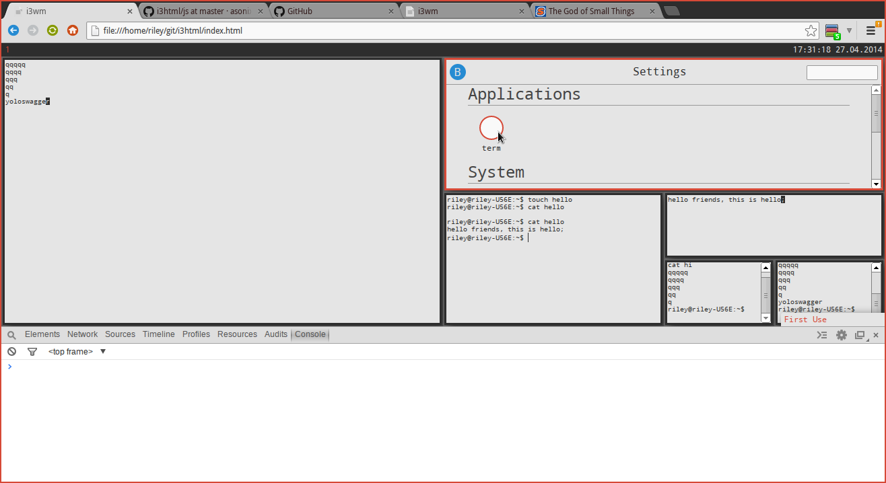

i3html
======

A web implementation of the i3wm with simulated bash+programs written from scratch.

This is a project for a web tech class I am currently in, and I am trying to write it without referencing i3's code. I feel like there could be a better way to do some of the things I've written code to do, but I'll only switch over if I really run into a road block with the way I'm doing things.

TODO:

 - WM:
  - Replace current window ResizeAll function (possibly mimic style of RepositionAll)
  - Remove RepositionAll's dependency on $WINDOW.next
   - Check parent size values from within child iteration unless $WINDOW.parent.type == workspace

 - TERM:
  - Add support for more commands

 - APPLICATIONS:
  - ?Music-player?
   - Learn HTML5
  - ?Web-browser?
   - iframes

KEYBOARD COMMANDS:
 - alt+enter - create new window
 - alt+q - remove new window
 - alt+h - next window will open to the right of the focused window
 - alt+v - next window will open below the focused window
 - alt+f - make the current window fullscreen
 - alt+d - open dmenu
 - alt+1 through alt+0 - switch workspaces

BASH COMMANDS:
 - cat [path to file] - display contents of file
 - cd, cd.., cd .., cd ~, cd /, cd [path of folder] - change directory
 - clear - clear console
 - contact - open the contact page
 - cp [path] [path2] - copy file from path to path2
 - dmenu\_run - open dmenu
 - edit [path to file] - edite file
 - exit - close the current terminal window
 - help - displays help dialogue
 - images: open the image browser
 - ls - list files and folders
 - mkdir [path] - makes a folder
 - mv [path] [path2] - move file from path to path2
 - rm [path to file or folder] - remove file, folder, or command (note: removing commands is not recommended)
 - rmdir [path to folder] - removes a folder
 - settings - open settings panel
 - term - open new terminal
 - termtest - INCOMPLETE open a more realistic terminal
 - touch [path] - creates a file
 - videos - open the video player
